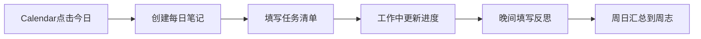

%%整理：【咸鱼】极客Code简%%


# 📖 模板库使用说明

> [!tip] 整理来源
> %%整理：【咸鱼】极客Code简%%

---

## 一、快速开始

> [!info] 前置条件
> 本模板库依赖社区插件，请确保以下插件已在 设置 → 第三方插件 中启用。

**第一步：配置 Templater(关闭安全模式)**

1. 设置 → Templater → 模板文件夹路径，填入各分类文件夹（或统一放入一个 `Templates` 文件夹）
2. 开启「触发 Templater 在新文件创建时」
3. 之后新建笔记时，使用命令面板（`Ctrl+P`）→ `Templater: 从模板创建新笔记`
![[截图_17750059227264.png]]
![[截图_17750051724759.png]]
![[截图_17750052019293.png]]
![[截图_17750052275833.png]]
![[截图_17750052424850.png]]

**第二步：配置 Dataview**

1. 设置 → Dataview → 开启「内联查询」和「JavaScript 查询」
2. 模板中的 `dataview` 代码块会自动渲染为动态表格

**第三步：开始使用**

1. `Ctrl+P` 打开命令面板
2. 输入 `Templater` → 选择对应模板
3. 填写笔记内容，保存即可

---

## 二、插件说明

| 插件 | 作用 | 配合模板 |
| ---- | ---- | -------- |
| Templater | 模板引擎，处理 `<% %>` 语法自动填入日期等 | 所有模板 |
| Dataview | 将笔记当数据库查询，生成动态列表/表格 | 概念、文章、项目等含 `dataview` 块的模板 |
| Tasks | 跨笔记管理任务，支持截止日期、优先级 | 日志、项目、旅行模板中的 `- [ ]` 任务 |
| Calendar | 日历视图，点击日期快速创建/跳转每日笔记 | 01-日志 分类 |
| Excalidraw | 手绘白板，可嵌入笔记 | 项目、概念模板中用 `![[图.excalidraw]]` 嵌入 |
| obsidian-git | 自动备份 vault 到 Git 仓库 | 全局，无需手动操作 |
| Table Editor | 表格可视化编辑，Tab 键跳格 | 所有含表格的模板 |
| Editing Toolbar | 富文本工具栏，快速加粗/高亮等 | 日常编辑 |
| Dynamic Outline | 右侧显示当前笔记大纲，快速跳转 | 长篇笔记，如书籍、课程模板 |
| PDF Plus | 增强 PDF 阅读，支持高亮并链接回笔记 | 06-书籍、21-文章 模板 |
| Recent Files | 侧边栏显示最近打开的文件 | 日常导航 |
| Mousewheel Image Zoom | 滚轮缩放图片 | 含图片的笔记 |
| Image Toolkit | 点击图片全屏查看、旋转 | 含图片的笔记 |
| Minimal Settings | 调整 Minimal 主题的布局和字体 | 外观配置 |
| Style Settings | 细粒度调整主题 CSS 变量 | 外观配置 |

---

## 三、各分类模板使用场景

### 📅 日志类（01）

> [!example] 典型工作流
> 每天早上用 Calendar 插件点击今日日期 → 自动创建每日笔记（`1.1 - 每日`）→ 填写任务和目标 → 晚上用 `1.10 - 每周回顾` 复盘

| 模板 | 使用时机 |
| ---- | -------- |
| 每日 | 每天早晨，记录任务、工作、反思 |
| 周志 | 每周一，规划本周目标 |
| 每周回顾 | 每周日，复盘本周完成情况 |
| 月度日志 | 每月初，设定月度目标 |
| 年度回顾 | 年末，总结全年成果 |

### 📁 项目类（03）

> [!tip] 配合 Tasks 插件
> 项目模板中的 `- [ ]` 任务会被 Tasks 插件统一收集，可在任意笔记中用以下查询显示所有未完成任务：
> ````
> ```tasks
> not done
> tags include 项目
> ```
> ````

### 💡 知识类（06 书籍 / 20 概念 / 21 文章 / 22 播客）

> [!note] Zettelkasten 方法
> 1. 读书/文章时用对应模板记录原文摘录
> 2. 提炼出核心「概念」，用 `[[概念名]]` 建立原子笔记
> 3. 概念笔记底部的 Dataview 查询会自动显示所有引用该概念的笔记

### ✅ 任务追踪类（14 追踪器）

配合 Tasks 插件，`14.2 - 习惯挑战` 中的打卡表格可用 Dataview 统计完成率：

```dataview
TABLE length(filter(rows, (r) => r.完成 = true)) as 完成天数
FROM "14 - 追踪器"
```

### 💰 财务类（24）

每月初新建一份 `24.1 - 月度财务`，用 Table Editor 插件填写收支表格（Tab 键快速跳格）。

### ✈️ 旅行类（25）

出发前新建旅行笔记 → 填写行程规划和打包清单 → 旅途中用 Excalidraw 画地图或路线 → 回来后补充旅行日记。

---

## 四、常用工作流

### 工作流一：每日回顾



### 工作流二：读书笔记 → 知识网络


### 工作流三：项目管理


---

## 五、快捷键建议

| 操作 | 快捷键 |
| ---- | ------ |
| 打开命令面板 | `Ctrl+P` |
| 从模板新建笔记 | `Ctrl+P` → 输入 Templater |
| 打开今日日志 | Calendar 插件点击日期 |
| 切换阅读/编辑模式 | `Ctrl+E` |
| 打开大纲 | Dynamic Outline 侧边栏图标 |
| 搜索全库 | `Ctrl+Shift+F` |

> [!warning] 注意
> 首次使用前请在 Templater 设置中指定模板文件夹路径，否则 `<% %>` 语法不会自动执行。
